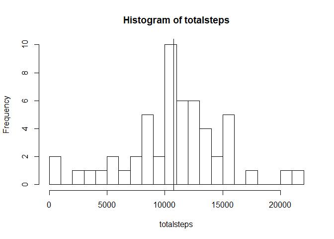
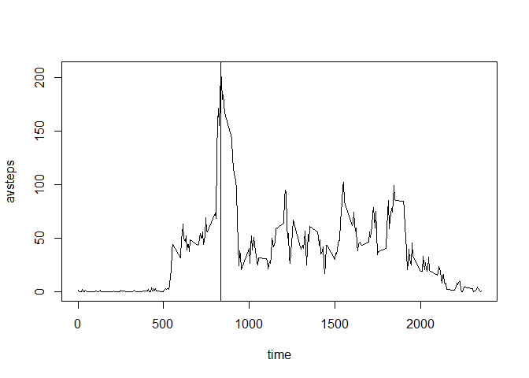
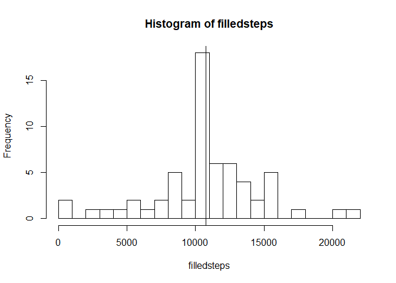
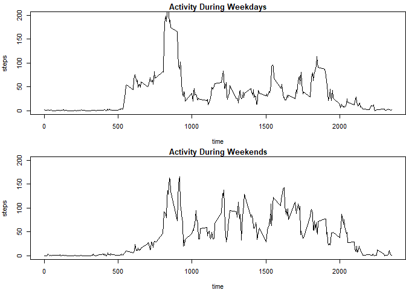

## Activity Monitoring Research


### Introduction

This document has been created as part of an Assignment for the "reproducable Research"  
online Course on Coursera.  
Using data from personal activity montitoring devices, a series of questions will  
be answered in this document.  
The dataset was downloaded from the course website.

### 1. Loading and preprocessing the data

As a first step, the data needs to be downloaded, unpacked and read into R.

```r
fileurl <- "https://d396qusza40orc.cloudfront.net/repdata%2Fdata%2Factivity.zip"
download.file(fileurl,"data.zip")
unzip("data.zip","activity.csv")
data <- read.csv("activity.csv")
```

### 2. Mean total number of steps per day

Next, the mean and median amount of steps per day will be calculated and illustrated  
using a histogram.

```r
#take the sum of each day
totalsteps <- sapply(split(data$steps,as.factor(data$date)), sum)
meantotal <- mean(totalsteps, na.rm = TRUE) 
print(meantotal)
```

```
## [1] 10766
```

```r
mediantotal <- median(totalsteps,na.rm = TRUE)
print(mediantotal)
```

```
## [1] 10765
```

```r
hist(totalsteps,breaks = 20)
abline(v = meantotal)
```

<!-- -->

The vertical Line in the Histogram indicates the mean number of total steps per day.  
This mean value is at 10766.19, whereas the median of steps per day is 10765.

### 3. Daily activity patterns

This section shows how active the users were throughout the day. the plot below  
shows the mean amount of steps for each five minute interval.

```r
#take the average of each interval
avsteps <- sapply(split(data$steps,as.factor(data$interval)), mean,na.rm = TRUE)
time <- unique(data$interval)
maxtime <- time[which.max(avsteps)]
print(maxtime)
```

```
## [1] 835
```

```r
plot(time, avsteps, type ="l")
abline(v = maxtime)
```

<!-- -->
  
On average, the most steps were made at 835.

### 4. Imputing missing Values

Since the dataset has many missing values, a method should be used to fill 
missing values in.


```r
numna <- sum(is.na(data$steps))
filleddata <- data
#fill the data with the average for the time 
#which(...)%%288+1 chooses the correct 5 min interval (288 per day)
filleddata$steps[is.na(data$steps)] <- round(avsteps[which(is.na(data$steps))%%288+1])
#take the sum of each day
filledsteps <- sapply(split(filleddata$steps,as.factor(filleddata$date)), sum)
meanfilled <- mean(filledsteps, na.rm = TRUE)
print(meanfilled)
```

```
## [1] 10766
```

```r
medianfilled <- median(filledsteps,na.rm = TRUE)
print(medianfilled)
```

```
## [1] 10762
```

```r
hist(filledsteps,breaks = 20)
abline(v = meanfilled)
```

<!-- -->

The amount of missing data in the activity dataset is 2304.
To fill these missing values, a simple method was used. If a value was missing, 
the average value for that time of day was taken (and rounded).
Since missing values are replaced by an average value, the mean and median value 
did not change. The little change in the mean value is due to the rounding error.


### 5. Differences in Activity Patterns between weekdays and weekends

To see different activities during the weeks and druing weekends the data will be split  
and the analysis from 3. will be applied again.


```r
days <- weekdays(as.Date(filleddata$date))
filleddata$week <- "weekday"
filleddata$week[days == "Samstag" | days == "Sonntag"] <- "weekend"
#split the data in week/weekend and interval
weeksteps <- sapply(split(subset(filleddata,week == "weekday")$steps,
                         as.factor(subset(filleddata,week =="weekday")$interval)), mean,na.rm = TRUE)

endsteps <- sapply(split(subset(filleddata,week == "weekend")$steps,
                         as.factor(subset(filleddata,week == "weekend")$interval)), mean,na.rm = TRUE)

par(mfcol = c(2,1), mar = c(4,4,1.5,0), cex = 0.66)
plot(time, weeksteps, type ="l", xlab = "time", ylab = "steps",
     main = "Activity During Weekdays", ylim = c(0,200))
plot(time, endsteps, type ="l", xlab = "time", ylab = "steps",
     main = "Activity During Weekends",ylim = c(0,200))
```

<!-- -->
  
The data shows that activities really differ on weekends. Compared to the weekdays  
the patients start their activity later but are overall more active during the day.


